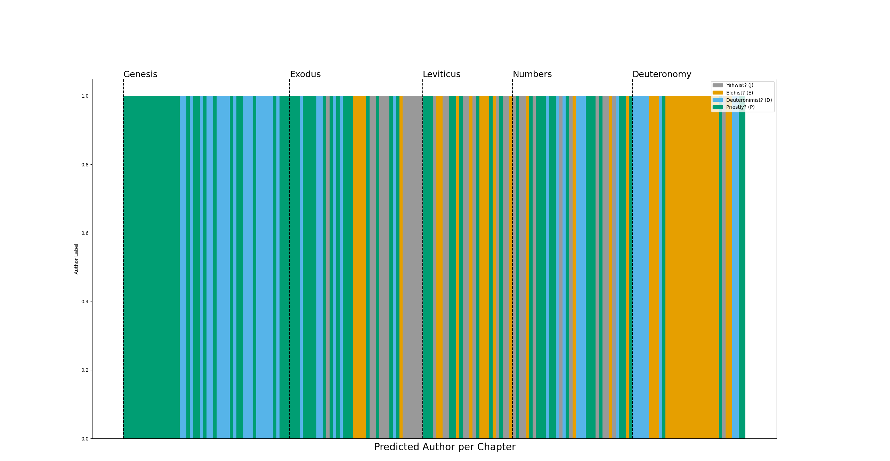
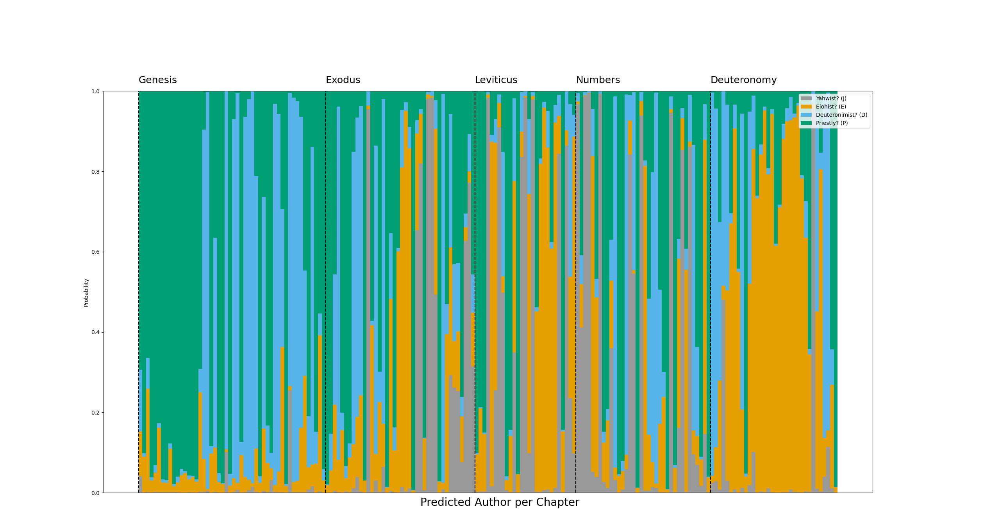
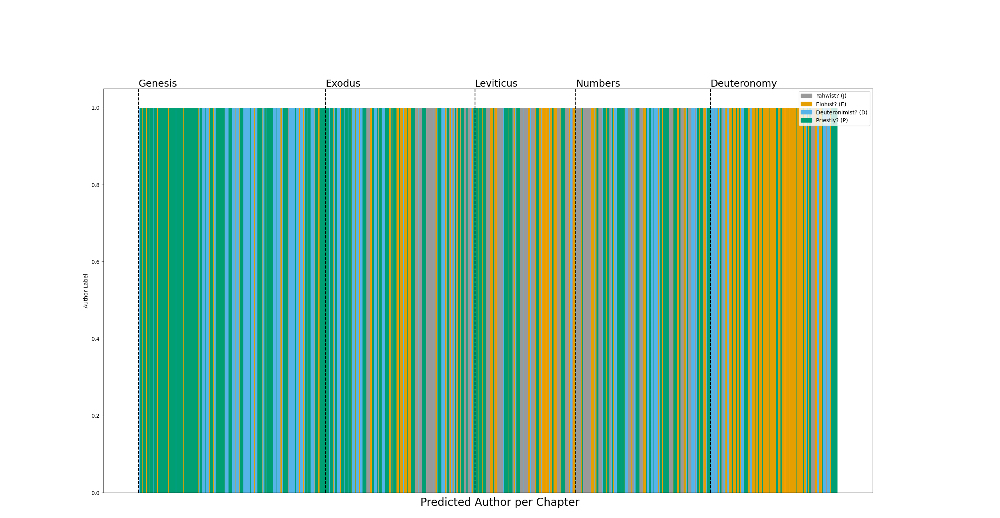

# Analysis of the Documentary Source Hypothesis

The following project will use extensively the following github as JSON for the Old Testament.

[GitHub](https://github.com/bcbooks/scriptures-json)

# Stylometry

Defined to be the statistical analysis of variations in literary style between one writer or genre and another.

For this project, I will use it to determine the current status on the JEPD or Documentary Source hypothesis, which states that the 5 books of Moses were actually written by 4 different authors. Currently its validity is questioned, and I will do research using the tactics of stylometry to determine the veracity of the Documentary Source Hypothesis (appreviated JEPD).

This will be done by first splitting the entire JEPD source into individual chapters. Each chapter will be graded according to the following 10 characteristics.

# Ten Characteristics of Authorship

1. Function words (the, and, of, in, etc.)
2. Word frequency Distribution
3. Type-Token Ratio (TTR) -- Unique words per Chapter
4. Average Word Length
5. Distribution of Word Lengths (where in sentences)
6. Sentence Length
7. Punctuation
8. Character Level Patterns (3-ngram)
9. POS-Tag Ratios
10. MTLD Lexical Richness Index

## Unsupervised Model

Using the metrics listed above, I will create an unsupervised model to attribute each chapter of the text to one of four authors. In terms of Machine Learning (ML), there is very little data in this dataset (only 186 chapters), so I will use a Hierarchical Clustering algorithm. `Scikit-Learn` provides a model called `AgglomerativeClustering` which fits my description. For the model, I will set `n_clusters=4` for obvious reasons.

Before running the model through the data, it will undergo two steps of preprocessing.

1. Normalization
2. Principal Component Analysis -- Dimensionality Reduction

Normalization is to be expected.

PCA (step 2) is used to reduce the number of dimensions (characteristics) used in the model. It finds the axes along which the data varies the most using eigenvalues and eigenvectors and projects the data onto the new axes corresponding to the eigenvectors. The end result is data that is easier for the model to analyze while still retaining most of the original information. I tried reductions into different dimensions, I settled by using `n_components=0.95` so the data is dimensionally reduced unto it accounts for `95%` of the data. For me, this settled at `48`.

After the normalization and dimensional reduction, I fit the model to the provided data from the Ten Characteristics, and produced the graphs as shown in `pictures`.

Unfortunately with `AgglomerativeClustering`, it only provides final predictions without probabilities, so I created a "soft" probabilities function that determines _roughly_ what the probability would have been.

With this information, I created 3 separate plots that show how the model predicted the results. The first graph corresponds to each chapter (the direct values from the model, no `probas`). The second graph shows the rough percentage of each author it assumes was present, with larger percentages showing up as larger vertical slices of each chapter. The final graph uses horizontal slides of vertical bars to show rough percentages per chapter.

## Caveats

I decided to use an unsupervised model (as opposed to a semi-supervised or supervised model) to make the authorship attribution as unbiased as possible. While there are bibles that show each source, I stayed away from them to allow the model to determine for itself the authorship of each chapter solely based on the Ten Characteristics. This means there is no textual bias in the data other than pure lexical analysis, but having some confirmation of certain sections would make the data far more concrete, like a semi-supervised model. Like stated above, I did not want to present any unwanted biases (i.e. if one of the sections attributed to one source is completely wrong), and analyze the first 5 books of Moses as a whole without external sources.
